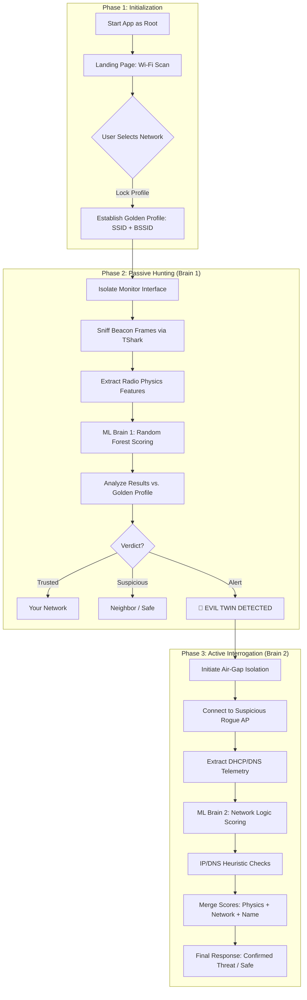

# Rogue AP (Evil Twin) Detection System

A multi-phase wireless security tool that combines **Radio Physics analysis** and **Network Telemetry interrogation** using Machine Learning to detect and confirm Rogue Access Points.

## 🏗️ System Workflow

## 📋 Operational Details

### Phase 1: Trusted Anchor Establishment (Golden Profile)
- **Goal:** Establish a baseline for the user's legitimate network.
- **Workflow:** The user connects to their trusted network via the landing page. The application extracts the **SSID** and **BSSID (MAC Address)** to monitor for clones or spoofed identities.

### Phase 2: Passive Surveillance (Brain 1 - Radio Physics)
- **Monitor Mode:** The app disconnects the interface from NetworkManager and activates monitor mode (performing hardware power-cycles where supported).
- **Packet Sniffing:** Uses `tshark` while channel hopping to capture beacon frames.
- **AI Analysis:** A Random Forest model analyzes 15 high-fidelity features (including timing deltas and signal strengths).
- **Detection Types:**
    - **Confirmed Evil Twin:** Matches Golden SSID but exhibits malicious behavioral patterns.
    - **Advanced Evil Twin (MAC Spoof):** Matches both SSID and BSSID, but detected via physical signal anomalies.
    - **Suspicious Clone:** Direct MAC mismatch for the trusted SSID.

### Phase 3: Active Deep Interrogation (Brain 2 - Network Telemetry)
- **Air-Gapping:** The system severs unrelated network connections for safe interrogation.
- **Direct Connection:** Connects to the suspected rogue network to capture network-layer telemetry.
- **Network Logic Scoring:** Analyzes DHCP configurations and DNS resolver settings using a secondary ML model.
- **Heuristic Indicators:** Flagging common attacker tool fingerprints (e.g., specific subnets like `10.0.0.x` or DNS servers integrated with gateways).
- **Threat Fusion:** Merges all scores into a final threat probability.

---

## 📂 Repository Structure

*   **/Application**: Core GUI application (`rogue_ap_gui_awid.py`) and live detection engine.
*   **/ML**: 
    *   **Model_1 (Features Extraction)**: Data preprocessing, AWID dataset integration, and "Champion" model training for radio physics.
    *   **Model_2 (DHCP/DNS)**: Training logic for network-layer interrogation.

## 🚀 Requirements

- Linux OS (tested for Evil Twin detection workflows).
- Root privileges (`sudo`).
- `tshark` (Wireshark) installed.
- `nmcli` and `iw` for interface management.
- Python dependencies: `pandas`, `joblib`, `ttkbootstrap`, `numpy`.
