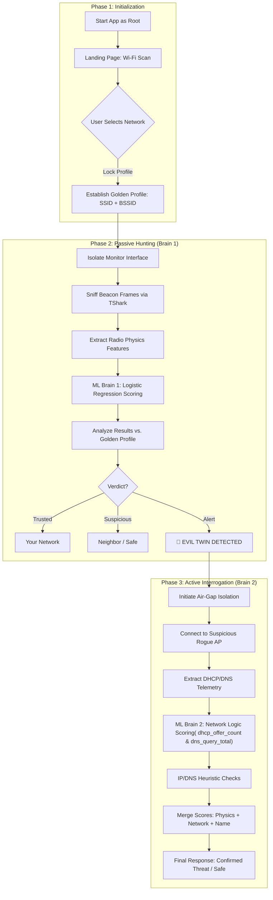

# Rogue AP (Evil Twin) Detection System

A multi-phase wireless security tool that combines **Radio Physics analysis** and **Network Telemetry interrogation** using Machine Learning to detect and confirm Rogue Access Points.

## 🏗️ System Workflow

## 🧠 Model Development & Data Engineering Deep Dive
This system relies on a dual-brain architecture. Developing these models required moving beyond standard machine learning tutorials to address real-world data inconsistencies, hardware limitations, and environmental noise.

### 1. Brain 1: Radio Physics (AWID Dataset Pipeline)
The primary challenge in wireless intrusion detection is the extreme environmental variance between the training lab and the deployment environment.

Data Ingestion & Scope: Leveraged the AWID dataset, isolating subsets 9, 10, 72, and 96 for training, while keeping subsets 72 and 96 strictly as unseen test data representing distinct physical environments. Filtered exclusively for 'Normal' and 'Evil Twin' classifications.

The "Overfitting" Hurdle: Initial feature extraction yielded 23 features. Training a Random Forest model on this dataset yielded excellent localized results, but failed critically on the unseen testing data (F1 Score: 51).

Failed Standard Mitigations: Standard Data Engineering approaches—including Normalization, Cross-Validation, and synthetic class balancing (RUS, SMOTE, and RUS+SMOTE)—failed to improve generalization. Normalization specifically broke down because wireless physics (e.g., dBm, time deltas) do not scale linearly across different physical rooms.

The Domain Shift Breakthrough: I pivoted from basic scaling to Domain Shift Analysis between the training and testing sets. I discovered that 7 specific features exhibited massive distributional variance depending on the physical adapter and environment. By surgically removing these highly variable features, I reduced the dimensionality to 15 robust features.

Final Champion: Re-evaluating 10+ algorithms on the refined 15-feature dataset revealed that Logistic Regression and Random Forest provided the highest resilience against environmental domain shift, forming the core of Brain 1.

### 2. Brain 2: Network Telemetry (Mininet Synthesis)
Because the AWID dataset focuses almost entirely on Layer 2 (Data Link / Physics), I required a separate dataset for Layer 7 (Application) interrogation. Since no comprehensive DHCP/DNS Evil Twin dataset existed, I engineered my own.

Simulation & Synthesis: Engineered a virtualized network topology using Mininet to simulate both legitimate gateways and aggressive Rogue APs.

Data Generation: Executed 10,000 automated simulations (6,000 Normal / 4,000 Evil Twin) to generate a custom dataset focusing specifically on dhcp_offer_count and dns_query_total. Attack tools naturally respond to DHCP requests at different latencies than enterprise routers, creating a detectable ML signature.

Heuristic Fallbacks: The ML model's prediction is aggressively fused with hardcoded security heuristics within the deployment application. The system actively flags attacker fingerprints, such as 10.0.0.x subnets, APIPA addresses, or identical Gateway/DNS routing paths.

### 3. Application Deployment & Hardware Workarounds
Deploying an ML model into a live Linux networking stack requires low-level hardware management to maintain system stability.

Multi-Threaded Architecture: The GUI (built with ttkbootstrap) runs entirely decoupled from the sniffing engine. Packet capture (tshark) and channel-hopping execute on daemon threads, preventing UI lockups during the 15-second "Hunts".

Kernel Freeze Prevention: Standard Kali Linux Wi-Fi adapters frequently crash when rapidly switching between Managed and Monitor modes under heavy packet loads. I engineered a surgical workaround using ethtool to identify the adapter's USB bus and execute a forced hardware power-cycle (unbind/bind) via the Linux sysfs before sniffing begins. This guarantees kernel stability during active threat interrogation.

The Security Air-Gap: Before initiating Phase 3 (Active Interrogation), the application severs all baseline system connections via nmcli to prevent lateral movement or data leakage while the system intentionally connects to the Rogue AP to extract telemetry.

## 📂 Repository Structure

*   **/Application**: Core GUI application (`rogue_ap_gui_awid.py`) and live detection engine.
*   **/ML**: 
    *   **Model_1 (Features Extraction)**: Data preprocessing, AWID dataset integration, and "Champion" model training for radio physics.
    *   **Model_2 (DHCP/DNS)**: Training logic for network-layer interrogation.

## 🚀 Requirements

- Linux OS (tested for Evil Twin detection workflows).
- Root privileges (`sudo`).
- `tshark` (Wireshark) installed.
- `nmcli` and `iw` for interface management.
- Python dependencies: `pandas`, `joblib`, `ttkbootstrap`, `numpy`.
